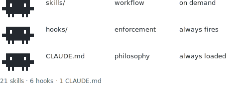

# tripod  v1.2.3




Claude follows instructions probabilistically. Some rules need to be structural.

---

## Three layers

```
                    tripod
                          |
        +-----------------+-----------------+
        |                 |                 |
   CLAUDE.md           hooks/            skills/
  (philosophy)       (enforcement)      (workflow)
  always loaded      always fires       on demand
        |                 |                 |
        +-----------------+-----------------+
                          |
              plugin installs all three
```

MCP servers extend what Claude can reach. `mcp-use` manages them per-project.

**Philosophy** (`CLAUDE.md`) defines how Claude reasons: the Tripod (antifragile, simple, research-first), the Contract (total saturation, no shortcuts), and the Error Recovery Protocol.

**Enforcement** (`hooks/`) makes rules structural. A rule in CLAUDE.md is a suggestion. A hook is a hard constraint. The wrong pattern becomes structurally impossible, not just discouraged.

**Skills** (`skills/`) give Claude the right cognitive mode for each moment in the workflow.

---

## Why three layers

Most Claude Code setups are skills-only. Skills are cognitive suggestions. Claude receives them as context, weighs them probabilistically, and may or may not follow them. A skill that says "don't use em-dashes" works until it doesn't.

A hook that blocks em-dashes at the file write level is a different category of thing. It cannot be forgotten. It cannot be deprioritized mid-session. It fires before the tool call completes.

CLAUDE.md works at a third level: it changes how Claude frames problems before any decision is made. The Tripod (antifragile, simple, research-first) runs before architecture, before implementation, before choosing what to build. Skills change what Claude does. CLAUDE.md changes how Claude thinks.

The three layers are not additive. They are multiplicative. Each one makes the other two more effective.

MCP servers are a different category. The three layers shape how Claude behaves within a session. MCPs extend what the session can see. Two in particular are substrate rather than tooling: [gitmcp](https://gitmcp.io) eliminates the knowledge cutoff by fetching live docs from any GitHub repo, and [keephive](https://github.com/joryeugene/keephive) eliminates statelessness by persisting memory, decisions, and knowledge across sessions. The three layers work on whatever Claude can access. These two expand what that is.

---

## Install

```bash
curl -fsSL https://raw.githubusercontent.com/joryeugene/tripod/main/install.sh | bash
```

Or manually:

```bash
claude plugin marketplace add joryeugene/tripod
claude plugin install tripod
```

Verify it worked. The CLI is silent on both success and failure, so confirm from within a new Claude Code session:

```
/update
```

The `/update` skill runs a health check: marketplace registration, plugin installation, skill count, hook count. If it reports issues, it prints the fix commands.

Alternatively, if you have the repo cloned:

```bash
git clone https://github.com/joryeugene/tripod.git
cd tripod
./verify
```

If `verify` shows all green, hooks and skills are loaded. Start a new Claude Code session to use them.

Copy `CLAUDE.md` manually to `~/.claude/CLAUDE.md` (global) or your project root.

Set the environment variables (recommended): copy the vars from `settings.json.example` into `~/.claude/settings.json` under the `env` key. See `env.sh.example` for descriptions.

### mcp-use (optional)

`mcp-use` makes per-project MCP composition a one-command operation. Every MCP server loaded in a session costs context: tool schemas inject at startup and every call response adds more. Loading six MCPs globally because you might need them is a different thing from loading two because this project needs them. Skills are loaded on demand and cost almost nothing. MCPs are not.

To install `mcp-use`, presets, and the statusline:

```bash
git clone https://github.com/joryeugene/tripod.git
cd tripod
./setup
```

`./setup` installs `mcp-use` to `~/.local/bin/mcp-use` and copies the presets to `~/.config/mcp-presets/` (only if they don't already exist, so local customizations are preserved).

From any project directory:

```bash
mcp-use                      # list available presets
mcp-use best                 # .mcp.json <- gitmcp + hive (foundation)
mcp-use playwright           # .mcp.json <- playwright MCP
mcp-use chrome               # .mcp.json <- chrome-devtools MCP
mcp-use browser              # .mcp.json <- playwright + chrome-devtools
mcp-use shad                 # .mcp.json <- shadcn-ui
mcp-use ui                   # .mcp.json <- shadcn-ui + chrome-devtools
mcp-use workspace            # .mcp.json <- Google Workspace
mcp-use asana                # .mcp.json <- Asana MCP (requires ASANA_ACCESS_TOKEN)
mcp-use all                  # .mcp.json <- everything
```

These are the bundled presets. Add your own to `~/.config/mcp-presets/<name>.json` and they appear automatically. Each preset is a JSON file with an `mcpServers` object matching the `.mcp.json` format. Build presets for your stack and share them across projects.

`best` is the foundation preset. It adds two servers that belong in every project:

- **gitmcp** - fetches live documentation from any GitHub repo. Claude's training ends at August 2025; the libraries you use do not. Ask Claude to look up current docs and it reads them directly.
- **hive** ([keephive](https://github.com/joryeugene/keephive)) - persistent memory across sessions. Facts, decisions, TODOs, and knowledge guides survive between conversations. Claude builds on prior work instead of starting from zero every time.

Both are global servers: install once, available in all sessions.

```bash
# gitmcp
claude mcp add --scope user gitmcp -- npx mcp-remote https://gitmcp.io/docs

# hive (requires keephive installed first)
uv tool install keephive
claude mcp add --scope user hive -- keephive mcp-serve
```

To use `mcp-use` as a shell function instead of a binary, source it from your shell profile. After `./setup` runs, the script is at:

```bash
source ~/.local/bin/mcp-use
```

---

## The workflow

```
  project starts
       |
       v
   /spec-writing explore  -- direction unclear? research, brainstorm, find the decision point
       |
       v
   /spec-writing  ---------- write problem, success criteria, non-goals
       |                     (task mode for concrete fixes: 4-line restatement, skip plan-mode)
       |
       v
   /plan-mode  ------------- auto-selects weight class from spec format:
       |                       routine spec = eng mode only
       |                       high-risk spec = CEO mode, then eng mode
       |
   coding begins
       |
       +--- /tdd + /verification-workflow  implementing from the plan
       |    (+ /agent-orchestration if 3+ independent tasks)
       |
       +--- /debugging-protocol ----- something broken?
       |                              phase 1: find+fix. phase 2: prevent recurrence.
       |
       +--- /performance ------------ slow? queries taking too long?
       |                              measure, name the pattern, fix one thing
       |
       +--- /security-review -------- feature touches user input or auth?
       |                              trace inputs, check named patterns
       |
       +--- /code-hygiene ----------- AI sessions are stateless.
       |                              keep the codebase clean.
       |
       |   (building UI?)
       +--- /visual-design ----------- visual identity before a line of code
       +--- /interaction-design ----- audience dimensions, modes, feedback, WCAG audit
       +--- /visual-verify ---------- element-level proof after UI changes
       +--- /browser-testing -------- network, console, forms, multi-tab
       |
       |   (review)
       +--- /pr-review -------------- receiving feedback? restate, YAGNI check
       |                              requesting review? dispatch subagent
       |
       |   (incident)
       +--- /incident-response ------ production down? triage, comms, postmortem
       |
       v
   /ship-pipeline ------ pre-flight review, merge, test, commit, push, PR
       |
       v
   /release ------------ versioned release: semver bump, tag, gh release create


  always active (no invocation needed)

   /agent-principles      the quality contract: evidence, schema-first, no hedging
   /agent-orchestration   parallel agents for independent work streams

  maintenance

   /update                  install, update, or sync tripod
```

---

## Artifacts

Skills that produce structured output write their results to disk automatically. No confirmation prompt. The path is printed after writing.

```
docs/
  specs/        <- /spec-writing      2026-03-17-feature-name.md
  plans/        <- /plan-mode         2026-03-17-feature-name.md (CEO)
                                      2026-03-17-feature-name-eng.md (Eng)
  audits/       <- /security-review   security-2026-03-17-feature-name.md
                   /interaction-design  interaction-2026-03-17-component.md
                   /code-hygiene debt   debt-2026-03-17.md
  incidents/    <- /incident-response  postmortem-2026-03-17-title.md
  rca/          <- /debugging-protocol 2026-03-17-bug-class.md
```

`/plan-mode` checks `docs/specs/` for a recent spec before asking for context, and reads existing plan files the same way.

These files are not committed automatically. Add them to `.gitignore` to keep them session-local, or commit them as project records. Either is correct depending on the project.

---

## The hooks

Six hooks ship with tripod. All fire on `PreToolUse`. The plugin registers them automatically. For manual setup, see `settings.json.example`.

| Hook | Matcher | Blocks | Why |
|------|---------|--------|-----|
| `block-unicode-dashes.py` | `Write\|Edit\|MultiEdit\|Bash` | Unicode em-dash and en-dash variants (U+2012..U+2015) | Prose quality rule made structurally impossible |
| `block-llm-typography.py` | `Write\|Edit\|MultiEdit` | ASCII arrows (`->` `=>`) and Unicode arrows in prose files; Unicode ellipsis U+2026; zero-width space U+200B; spaced double-hyphen ( -- ) | LLM typographic fingerprints. Humans type `...` and write out relationships in words. |
| `block-co-authored-by.py` | `Bash` | Claude attribution lines in git commits | Claude Code hardcodes this into every commit message. This hook removes it. |
| `block-git-stash.py` | `Bash` | `git stash` in any form | Destroys other agents' working state. Structurally absent, not just discouraged. |
| `block-no-verify.py` | `Bash` | `--no-verify` in git commands | Bypassing hooks defeats the enforcement layer. Fix the root cause instead. |
| `block-tmp-files.py` | `Write\|Bash` | Writes to `/tmp/` and `mktemp` | Files in /tmp are silently lost on cleanup. Write to the project directory. |

---

## The skills

Each skill owns one moment in the workflow. Invoke with `/skill-name` in Claude Code.

| Skill | Reach for it when... |
|-------|----------------------|
| `/agent-principles` | Always active. The quality contract: evidence-first, no hedging. |
| `/agent-orchestration` | You have 2+ independent tasks that can run in parallel. |
| `/deep-research-session` | User gives sustained time: "we have 3 hours", "all night", "go deep". Clock discipline, tier structure, pivot protocol. Do not stop early. |
| `/spec-writing` | First. Explore mode for brainstorming and research; structured mode for the 7-section spec. Required before plan-mode. |
| `/plan-mode` | After spec-writing. Auto-selects weight class: skip (task-mode specs), eng-only (routine), or CEO+eng (high-risk). |
| `/tdd` | Writing any feature or test. Failing test first, always. |
| `/debugging-protocol` | Something isn't working. Phase 1: schema first, trace back, fix. Phase 2: name the root cause, make recurrence structurally impossible. |
| `/verification-workflow` | After any code change. Prove it works before moving on. |
| `/performance` | Code is slow. Queries taking too long. Suspect N+1, O(n squared), or missing indexes. |
| `/security-review` | Feature touches user input, auth, file paths, or database queries. |
| `/code-hygiene` | AI-session debt accumulating: dead exports, duplicate logic, orphaned types. Also: `/code-hygiene debt` for tech debt audit with prioritization. |
| `/pr-review` | Receiving PR feedback or requesting review before merge. Restate, YAGNI check, two-stage review. |
| `/incident-response` | Production down or alert fires. Severity classification, comms, blameless postmortem with 5 whys. |
| `/visual-design` | Starting UI work. Visual identity: color, typography, spacing, the AI slop test. |
| `/interaction-design` | Before shipping UI behavior or auditing for compliance. Audience dimensions, discoverability, modes, feedback, WCAG 2.1 AA. |
| `/visual-verify` | After UI changes. Element-level proof before declaring done. |
| `/browser-testing` | Deep browser testing. MCP tools (Playwright, Chrome DevTools) and the browse CLI for persistent daemon testing. |
| `/figma-api` | Extract design specs, node properties, or export images from a Figma URL via the REST API. |
| `/asana` | Manage Asana tasks from the terminal. CLI for common operations, REST API for kanban section moves, MCP mode for conversational access. |
| `/ship-pipeline` | Ready to ship. Pre-flight review, merge, test, commit, push, PR. |
| `/release` | Versioned release. Semver bump suggestion, version file update, annotated tag, `gh release create`. Run after the PR merges. |
| `/update` | Install, update, or sync tripod. Dev path runs `./update`; user path runs `claude plugin install`. |

---

## CLAUDE.md

`CLAUDE.md` is the operating spec. It defines three things:

1. **The Tripod** - root philosophy that governs every design decision
2. **The Contract** - rigor standards (total saturation, no shortcuts, adversarial thinking)
3. **Forbidden Patterns** - antifragile list of banned behaviors; grows with every failure

Adapt it for your stack:

**Keep as-is:** The Tripod, the Contract, Error Recovery Protocol, the absolute BANNED tier.

**Customize:** The Quick Reference trigger table (add your tools and workflows). The Forbidden Patterns anti-patterns tier (add failure patterns you encounter). The Prose Quality Standards are optional if you don't write prose with Claude.

Place the file at `~/.claude/CLAUDE.md` for global effect, or at the project root for project-specific behavior.

---

## Environment

Claude Code exposes environment variables that significantly change its behavior. These are set before a session starts. See `env.sh.example` for the full list with explanations.

Key variables:

| Variable | Value | Effect |
|----------|-------|--------|
| `CLAUDE_CODE_MAX_OUTPUT_TOKENS` | `65536` | Prevents response truncation on long outputs |
| `BASH_DEFAULT_TIMEOUT_MS` | `300000` | 5-minute default; prevents premature kills |
| `BASH_MAX_OUTPUT_LENGTH` | `100000` | Captures full output from verbose commands |
| `CLAUDE_CODE_EXPERIMENTAL_AGENT_TEAMS` | `1` | Enables parallel agent spawning |
| `CLAUDE_AUTOCOMPACT_PCT_OVERRIDE` | `80` | Compacts at 80% context, not 95% |
| `CLAUDE_BASH_MAINTAIN_PROJECT_WORKING_DIR` | `1` | Shell cwd persists across tool calls |
| `CLAUDE_CODE_DISABLE_NONESSENTIAL_TRAFFIC` | `1` | No telemetry pings during sessions |
| `BASH_MAX_TIMEOUT_MS` | `600000` | 10-minute ceiling for long-running operations |
| `MAX_MCP_OUTPUT_TOKENS` | `50000` | Prevents MCP servers from flooding context with verbose output |
| `DISABLE_COST_WARNINGS` | `1` | Silences cost warnings (useful on Max plan) |
| `CLAUDE_CODE_DISABLE_FEEDBACK_SURVEY` | `1` | Silences periodic feedback survey prompts |

Two ways to apply: source `env.sh.example` from your shell profile, or copy the variables into `~/.claude/settings.json` under the `env` key (recommended: settings.json approach applies at session start without shell config changes).

### Statusline

`statusline.sh` provides a compact Claude Code status display: current directory, git branch, context usage percentage, active plan, model, and subscription tier. Wire it into `settings.json`:

```json
"statusLine": {
  "type": "command",
  "command": "bash ~/.claude/statusline.sh"
}
```

---

## Local development

Clone the repo, make changes to skills or hooks, then sync to the plugin cache:

```bash
git clone https://github.com/joryeugene/tripod.git
cd tripod
./sync
```

`./sync` does four things in order:

1. **Version bump** — reads the latest git tag; if it differs from `plugin.json`, updates both metadata files.
2. **Cache migration** — if the installed version is older, copies the cache to a new versioned directory and updates `installed_plugins.json`.
3. **Content sync** — rsyncs skills, hooks, CLAUDE.md, and all other plugin assets to the active cache path. Also cleans up any orphaned version directories left by previous installs.
4. **Marketplace snapshot sync** — updates `~/.claude/plugins/marketplaces/tripod/` with the current repo content. Claude Code reads this snapshot on startup to determine the available version; keeping it current prevents stale versions from being recreated in the cache.

Start a new Claude Code session after `./sync` to pick up the changes.

`./verify` runs a health check without making any changes: marketplace registration, plugin install, version alignment, skill and hook counts.

---

## Adding your own hooks

1. Write a Python script that reads tool input from stdin (JSON)
2. Print a block decision to stderr and exit 2 to block the tool call
3. Exit 0 to allow it
4. Add an entry to `hooks/hooks.json` with the matcher and command

`block-unicode-dashes.py` is a readable reference implementation. The matcher field scopes the hook to specific tools: `Write|Edit|MultiEdit` for file operations, `Bash` for shell commands, or combinations like `Write|Bash`.

---

## Extending with more skills

Drop any directory with a `SKILL.md` into `skills/`. The plugin auto-discovers it.

Skill files are markdown with a YAML frontmatter block:

```markdown
---
name: my-skill
description: When to reach for this skill. Written as a trigger condition, not a topic name.
---

# Skill content here
```

The `description` field is what Claude matches against task context. Write it as a trigger condition: "Use when X" or "Reach for this when Y." A description that names the symptom ("something is slow", "scope is unclear") will fire at the right moment. A description that names the topic ("performance optimization") may not.

For custom skills outside this repo, create a second plugin directory and register it separately with `claude plugin add ./my-skills`.

---

## Browser automation

Two approaches to browser testing. Both ship with tripod.

**MCP presets** (zero build step): Playwright MCP for E2E automation and Chrome DevTools MCP for network/console inspection. Standard MCP tools that Claude calls natively.

```bash
mcp-use browser              # playwright + chrome-devtools
mcp-use playwright           # automation only
mcp-use chrome               # inspection only
```

**browse CLI** (persistent daemon): a compiled binary that keeps Chromium running between calls. First call ~3s, subsequent calls 100-200ms. Accessibility tree refs (`@e1`, `@e2`) that fail fast on stale DOM. Cookie import from Chrome/Arc/Brave/Edge via macOS Keychain. 30-minute idle shutdown.

```bash
cd <tripod-repo>/browse && ./setup
```

Requires [bun](https://bun.sh) v1.0+. Based on [gstack](https://github.com/garrytan/gstack) by Garry Tan (MIT).

The `/browser-testing` skill documents both approaches and helps you choose based on the task.

---

## keephive

[keephive](https://github.com/joryeugene/keephive) is the memory layer for Claude Code. It pairs directly with tripod.

Claude Code sessions are stateless. Each conversation starts from zero. keephive fixes this: a background process captures facts, decisions, and TODOs during sessions, stores them in a structured daily log, and injects the relevant context back into future sessions via the `hive` MCP server.

What it provides:

- `hive_remember` - save a fact, decision, or TODO from the current session
- `hive_recall` - search accumulated knowledge from all past sessions
- `hive_status` - see what's pending, what's stale, what needs attention
- Knowledge guides - reusable markdown files Claude loads when working in a specific domain
- The KingBee daemon - background agent that verifies stale facts, drafts standups, and surfaces patterns across sessions

Install:

```bash
uv tool install keephive
claude mcp add --scope user hive -- keephive mcp-serve
keephive setup   # registers hooks in ~/.claude/settings.json
```

The `best` preset (`mcp-use best`) adds the `hive` server to any project's `.mcp.json`.
